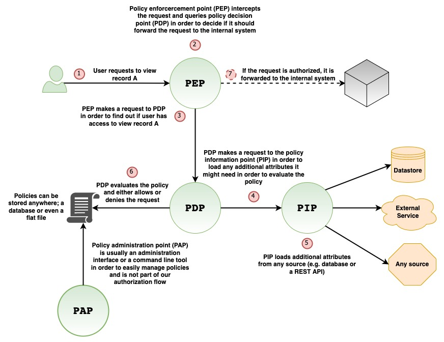
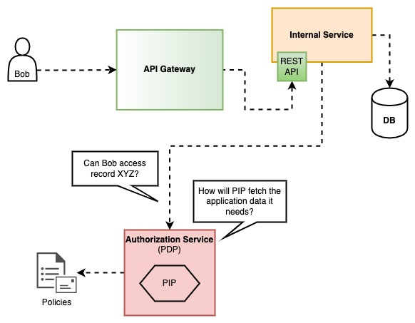
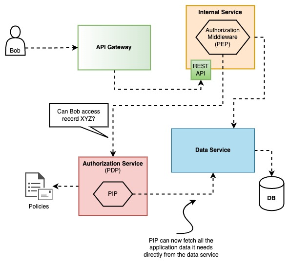
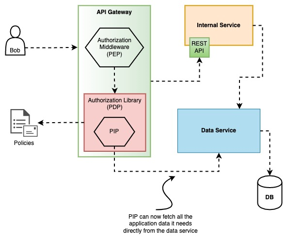
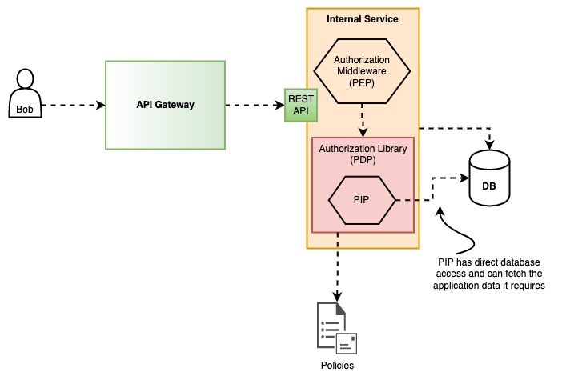

> Authorization? How hard can it be? I am pretty sure that others have already solved it. We are not the first ones doing microservices. It should be easy to integrate what's already out there. 
> 
> \- Everybody when they started designing their microservices, before they cried

**Fine-grained authorization in microservices is hard.** Definitely not impossible, but hard. You would expect that a more standardized, all-around, full-proof solution is out there, but I am afraid there isn't. It's a complex matter and depending on what you are building, implementation varies.

You will probably start with a boolean `admin` flag in your `User` model and then you will replace it with a `role` field, as we all did. However, as things progress and the business model becomes more and more complex, so do the solutions that we need to implement in order to deal with that complexity.

But how do you actually go **from a simple flag** to **Role Based Access Control (RBAC)** and then to **Attribute Based Access Control (ABAC)**, especially in a microservices environment? In the following post I hope to help you get there.

*(UPDATE: 02/04/2022): This article made it to the HackerNews frontpage and some interesting comments can be found [here](https://news.ycombinator.com/item?id=30878926). Feel free to participate!*

<!--truncate-->

## The monolith

The first time I had to deal with a more complex authorization system was in a **monolithic CMS application** written in `PHP 5.x`, on top of **Zend Framework** (now known as Laminas Project), with a **MySQL** backend, a billion years ago. The app was following the hot and trendy **Model-View-Controller (MVC)** pattern and the requirement in the specific project was, except hierarchical role-based access control (H-RBAC), to have more fine-grained permissions as well as to be able to answer two specific questions: 

1. **Can the user do X on a Y resource if their role allows it or if the resource is owned by them?**
2. **Can the user A, with role X, access the data of user B, that has the same or a higher level role?**

(For the sake of simplicity and because it does not really offer any extra value, I will skip the implementation details of question 2 and I will just use question 1 for my example below).

After thinking about the situation, and the fact that we had a VERY specific problem to solve, that I KNEW it wouldn't change in the future, and ALL the data models were associated with a single user, this is what a very simplified version looked like (forgive my PHP, it's a bit rusty):

```php title=controllers/items_controller.php
class ItemsController extends Zend_Controller_Action {
  // ...omitted code
  
  public function listAction() {
    $page = $this->_getParam('page', 1);
    $orderBy = $this->_getParam('order_by', 'created_at');
    $order = $this->_getParam('order', 'desc');
    
    $filters = array('drafts' => false);
    $user = Session::getUser();
    
    if ($user->isAuthorized('can_list_drafts', 'items')) {
      $filters['drafts'] = $this->_getParam('drafts', false);
    
    $result = ItemModel::find($filters, $page, $orderBy, $order);
  
    return $result;
  }
  
  public function destroyAction() 
  {
    $itemId = $this->_request->getParam('itemId');
    $item = ItemModel::findById($itemId);
  
    if (!$item) {
      throw new ItemNotFoundException();
    }
    
    $user = Session::getUser();
    
    if (!$user->hasRoleOrSelfPermissionOn('can_delete_items', 'can_delete_own_items', 'items', $item)
      throw new AuthorizationException();
    
    $result = $item->destroy();
    
    return $result;
  }
  
  // ... rest of code
}
```

```php title=models/user.php
class User {    
  // ...omitted code
  
  public isAuthorized($permission, $resource) 
  {
    // The ACL singleton class is a wrapper around Zend ACL which is a module that provides you
    // with hierarchical, role based, access control lists which you can query and check
    // if a role has the requested permission on a resource.
    if (ACL::getInstance()->isAuthorized($this->role, $permission, $resource)
      return true;      

    return false;
  }
  
  public hasRoleOrSelfPermissionOn($rolePermission, $selfRolePermission, $resource, $model)
  {
    if ($this->isAuthorized($rolePermission, $resource) {
      return true;
    }
    elseif ($model.userId == $this.id) {
      if ($this->isAuthorized($selfRolePermission, $resource))
        return true;
    }
    
    return false;
  }
  
  // ...rest of code
}
```

A few things are going on above:

1. **The decision point and enforcement of authorization is happening in the controller, getting mixed with application code that does not care about all these things**, plus, it makes it harder to test. We do not want that. We want our controllers to be lean (in terms of responsibilities) and just return appropriate responses which are related to what was requested in the first place. 
2. In `listAction` we need to check individual filters in order to decide if the user is authorized to use them or not. If multiple filters exist that need to be checked, the controller will become too messy, too fast.
3. The application data that the authorization requires (in this case `$item`) are locally available and easily loaded with our `ItemModel` class. As you will understand later, loading necessary application data is the biggest pain point.
4. The `User` class is suddenly coupled with authorization. It shouldn't. It should only care about the user entity itself, like the class name implies.
5. `hasRoleOrSelfPermissionOn` makes the assumption that all models have a `userId` field which means that we should know beforehand that this will be true (forever) or else the function will not work as expected. 

**The authorization code is tedious, poluting the controllers, and error prone**. However, we were also lucky because this was the ugliest it could get (based on project requirements) and therefore it was acceptable (or at least we persuaded ourselves that it was), instead of pushing to a more complex solution. If, for example, there was the requirement of checking multiple model attributes (or attributes from different models), depending on the controller action, then `hasRoleOrSelfPermissionOn` wouldn't be able to cover everything and the controllers would immediately become much messier. It did serve us well back then but I no longer like it because avoiding tangling code at some point became a priority.

**What I am describing above is not inherent to monoliths.** The same implementation could have been done in a microservice (and I have seen it in multiple occasions, with everything done in the controllers) if the application data that the authorization mechanism required, lived under the same roof. But more on that later.

#### So, what could we have done to improve the above situation?

Push the authorization code higher up in the stack. That would mean that you could push it to somewhere like a `middleware`, as most web frameworks call it, which is basically code that is executed before your controllers. And this, is where the fun begins and a whole new set of implementation problems rises!

But before we dive into that, we need to think about our authorization flow in a more abstract level.

## Authorization flow overview

So, what would this authorization mechanism look like in order to not force a single architecture but be more flexible instead? The following diagram will give you an idea:

<div style={{textAlign: "center"}}>



</div>

**The flow goes like this:**

1. User requests to view record A.
2. The requested is intercepted by the **Policy Enforcement Point (PEP)**. This is usually a **middleware**, or generally speaking, a layer in your stack, as high as possible, in order for the request to stop right there in case it's not authorized, instead of allowing it to travel deeper in the system.
3. **PEP** makes a request to the **Policy Decision Point (PDP)** in order to figure out whether or not the request is authorized to move forward. PDP will probably be a library that keeps track of roles, permissions and resources and expose an interface in order to query it and get a boolean answer whether or not someone can do something on a resource.
4. **PDP** *might* need extra information in order to decide if the request should be allowed or denied so it needs to ask the **Policy Information Point (PIP)** for that extra information. That extra information can be retrieved from a database, from a flat file, from an external service or from any other source you need. PIP could be just another library which PDP can use internally if it needs to.
5. **PIP** loads the extra information and returns it to the PDP.
6. **PDP**, in combination with the extra information it got from PIP, evaluates the defined policy (which can be stored anywhere you like, e.g. database or flat file), and decides whether or not the request has access to the underlying resource based on what the policy says. 
7. The answer **is returned to PEP**, which either allows or denies the request to move forward.

On the diagram above there is another piece, **the Policy Administration Point (PAP)**. This is basically an optional interface that helps you manage the policies. It can be anything, a web interface, a command line tool, a desktop GUI or you can just skip it entirely if you do not want to provide it and do everything manually instead.

## Architectures

Now that we have defined our authorization flow, let's go through a few real world architectures together. All the following architectures include a diagram and within this diagram I make clear what plays which role based on what I showed you earlier.

### With an authorization service

So, you are there thinking, I am doing microservices, right? So the logical thing to do is to implement an **authorization service** and everybody would be able to use that and keep your precious service boundaries, right? **WRONG**. Your hell, has just begun!

<div style={{textAlign: "center"}}>



</div>

**How will PIP fetch the application data that PDP needs?**

1. **Direct DB reads:** I am pretty sure someone will suggest this, and then will say, *"I know we shouldn't be doing this in microservices but let's just make this exception"*, but that's how all big problems are created. With a small exception here, with another one there, and then things start to blow up, or even worst, become unmaintenable. Direct DB reads, outside the domain of each service, is a bad idea and it will be obvious to you why on the first schema change. Please don't be lazy and just say no to this.
2. **Attach all the extra data to the authorization service call:.** By doing this you will probably increase the network traffic and you might cause a bottleneck on the service if every request has a lot of data attached. However, these - manageable - disadvantages are not even my main concern with this approach. My main concern is the fact that the caller now needs to know the authorization logic that will be used internally by the authorization service in order to send the appropriate data. This will probably lead to callers sending more data than they should, or not removing data from the call whenever a policy changes, "just to be sure", and as a result the code maintenance will become harder. Even in a perfect world, were the data are ALWAYS exactly what is needed, the extra work of choosing the data is a burden that the caller should not have.
3. **Keep a copy of the data the authorization service needs:** This basically means syncing the data from all the other services, to the authorization service database, with a generic model that will be able to fit (in terms of a schema) everything. I can tell you right now that, this is difficult to achieve, especially if the syncing is experiencing network delays and/or conflicts. There are others who are doing this (check [Google Zanzibar](https://research.google/pubs/pub48190/)), but for most mortal companies I think dealing with the complexities of syncing on your first implementation, is an overkill. Besides, even Zanzibar is not a silver bullet and it's higly opinionated with its models, so you might need to build extra parts that communicate with it in order to achieve what you want. 


### With an authorization service and a data service

<div style={{textAlign: "center"}}>



</div>

This is probably the most complex architecture but it definitely clears things up a bit. If the data state and the mutations are all handled by the same layer (a data service), and all other services use that layer, it's like they have direct access to the database and the PIP can now fetch whatever it needs.

Personally, I like this architecture because now there is a very clear seperation of who is doing what, even if it means that more code will be required in order to set it up. Building a data service is beyond the scope of this post so I will just keep it simple and say that you shouldn't start with this, unless you already have a data service implemented or if you have other needs for it that go beyond authorization.

#### Variations

There are a couple of variations with this architecture that I would like to mention since someone might find them interesting.

**Instead of doing the authorization within each internal service, you could do the authorization at the API Gateway.** You can use an authorization middleware within the API Gateway in order to communicate with the authorization service, or, you can even get rid of it completely and communicate with the data service directly from the middleware.

<div style={{textAlign: "center"}}>



</div>

This has the advantage of stopping the request as early as possible before it has the chance to reach the internal services. In general, I like that idea.

However, it also has a couple of disadvantages: 

1. When services make internal calls, they will be bypassing the authorization checks. It might be acceptable in your case but personally I do not like it. I want each service to allow only what is expected and nothing more. You could enforce in your implementation to make all the calls go through the API Gateway but then you increase the network latency and you lose all the advantages of actually having an internal network.
2. API Gateway will need to have all the application data loaders (for PIP) implemented there and things might get messy if you are implementing too much. Especially if you have a lot of services you might be changing API Gateway too often for reasons unrelated with the service itself.

### With an authorization middleware and library per service

<div style={{textAlign: "center"}}>



</div>

In my opinion **this is probably a good balance between complexity and a scalable solution**. You basically keep the authorization logic in each service and each service is responsible for the authorization rules of its own domain.

One thing you will probably need is to have the common code implemented as a library (or libraries) since it will be shared among all services but it shouldn't be a problem. Just make sure you cover it with enough tests!

The real question with this approach is; **how homogeneous is your system**? If it's 100% then you are in luck. You will only need to implement (or find) everything you need once. if it's not, you will need to do it for every different language you are using in your system. Even though there are plenty of libraries out there, depending on your system details, they might not integrate very well or they might be missing a couple of features that you might need. Before you are too eager to implement your own, make sure if an existing solution covers your needs. If it does not, maybe you can get away with it by doing a few changes on your side, or by adding those missing features to the library you found. Whatever you do, take the time to decide carefully.


## Implementation

### RBAC

If you are doing RBAC, then implementing this is straight forward and clean. You just need a middleware (PEP) in which you must check if the user role (usually attached to a JWT that comes with the request) has access to the specified route path. The policies can easily be stored in a database or a configuration file, load them upon service initialization and let the RBAC library (PDP) that you will use do its work from within your middleware. In this case, no PIP is required.

There are a lot of good solutions out there for RBAC, for any modern web framework from any language, so I will not go into details about this, but I just wanted to briefly mention it. **The only tip I do wanna share though, in case you are implementing something custom**, is that the **resource** in your policies will probably be the **regex route path** and the **permission** will be the **HTTP verb** (`GET`, `DELETE`, etc). By doing that, you can easily get the route path from within the middleware and use a regex route matcher library to check if the resource is a match.

### RBAC/ABAC

So let's assume that you go with option 3, with an authorization middleware and library per service. How would such implementation look like?

The following implementation approach is neither the best, nor the only one. It is however applicable to the real world and that's what is important for me. **What we are basically trying to answer with our implementation is:**

1. **How will my authorization mechanism load the necessary application data it needs?**
2. **How will I express my policies, in a non confusing way, and be able to access dynamically loaded data from within those policies?**

By answering the above questions we will also be able to provide a better answer back to our friend *the monolith* and its question, *how will we allow a user to do X on Y resource if their roles allows it, or if it's owned by them?*

The example is written in `Node.js`, but I am confident you can do something similar in any web framework of your choice. Also, please do keep in mind that I have omitted a lot of code and kept a flat structure in order to try to reduce any confusion with unecessary implementation details. I understand that it can be frustrating but I will try to explain in detail what everything is supposed to do.

```js title=server.js
import express from 'express'; // express is a web framework for Node.js 
import logger '/your/logger';
import {
  AccessControl, 
  ROLE, 
  PREDICATE
} from '/your/access/control/lib';

// `express.js` router handler for listing items and assigned to route `GET /items`. 
// The assignment is done in our `routesObject` further below.
async listItemsHandler(res, req, next) {
  const items = await ItemModel.find(req.query);
  
  // ... rest of handler; no authorization checks required 
}

// `express.js` router handler for getting a specific item and assigned to route `GET /items/:id`. 
// The assignment is done in our `routesObject` further below.
async getItemHandler(res, req, next) {
  const {id} = req.params;
  
  const item = await ItemModel.findById(id);
  
  if (!item) {
    throw new ItemNotFoundError();
  }
  
  // ... rest of handler; no authorization checks required
}

/*
  This is a function that represents an `express.js` middleware. It's basically code that will run BEFORE 
  the `listItemsHandler` and the `getItemHandler` implemented above. The middleware acts as the PEP 
  and  internally uses our access control library in order to decide if it should allow a request or not.
  
  Check here for extra info on middlewares: https://expressjs.com/en/guide/using-middleware.html
*/
function authorizationExpressMiddleware(request, response, next()) {
  // Get the user object from the JWT token that is attached to the request.
  // Usually this happens within a middleware higher up in the middleware chain.
  const user = request.locals?.user? || null;
  const userRole = request.locals?.user?.role? || ROLE.GUEST;

  // This is just an object with data that we want to pass to our access control library that is related
  // with this request. Everything in this object will be accessible by specifying the appropriate 
  // object path in the `conditions` key of our policy definitions as we will see later.
  const context = {
    user,
    request
  };

  const action = request.method; // GET, DELETE, PUT, etc
  const resource = path.join(request.baseUrl, request.route.path); // e.g. /items/:id

  // Check if the current request is authorized, by also including our `context` object. 
  const isAuthorized = await accessControl
    .withContext(context)
    .can(userRole, action, resource);
    
  // If the request is authorized, then pass the control to the next middleware in the chain.
  if (isAuthorized) {
    return next(); 
  }
  
  // Request is UNAUTHORIZED. Set the HTTP response status and stop the rest of the middleware 
  // chain from executing by returning an error. The request will stop here.
  response.status(401); // Unauthorized
  next(new AuthorizationError());
}

/*
  Initialization function for our access control library. This is an imaginary custom PDP library
  that internally uses an imaginary custom PIP library. Using the PIP part of the access control 
  library should be optional.
*/
function initAccessControl(endpointsObject) {
  // PIP loader function in order to load a specific item and provide to
  // the access control library the extra information it needs.
  const pipItemLoader = async (itemId) => {
    const item = await ItemModel.findById(itemId);
    
    if (item) {
      return item; 
    }
    
    return null;
  }

  // Initialize the access control library with two roles. The library should be able 
  // to support hierarchical roles in order to inherit permissions from a parent role 
  // instead of repeating them, just like below.
  const roles = [{
    name: ROLE.USER
  }, {
    name: ROLE.ADMIN
    inherits: [ROLE.USER]
  }];
  
  const accessControl = new AccessControl(roles);
  
  // Add our loader to the access control library in order to be able to use it internally when necessary.
  accessControl.addLoader(PIP_LOADER_TYPE.ITEM, pipItemLoader)
  
  // `buildPermissions` is a custom utility function that parses the `accessControl` key object value from 
  // our endpoints object and creates a list of permission objects, formatted the way our access
  // control library expects them.
  const permissions = buildPermissions(endpointsObject);

  accessControl.addPermissions(permissions);

  return accessControl;
}

// The following object contains everything we need to describe all the exposed routes. Within the object,
// we have also embedded our authorization policies via the `accessControl` key. Within this key, we specify
// which role can do what and under which conditions.
const routesObject = {
    middlewares: [authorizationExpressMiddleware],
    endpoints: {
     '/items': {
      '/': {
        GET: {
          handler: listItemsHandler,
          accessControl: {
            permissions: [{
              role: ROLE.USER,
              // The 'user' role can only list items which the `user_id` filter matches the user who request them.
              condition: {predicate: PREDICATE.EQUAL, args: ['$.request.query.user_id', '$.user.id']}
            }, {
              role: ROLE.ADMIN,
              // The admin role can list items with any filters they like.
              condition: * // Any filter is allowed
            }]
          }
        },
        '/:id': {
          GET: {
            handler: getItemHandler,
            accessControl: {
              loader: {fn: PIP_LOADER_TYPE.ITEM, args: ['$.request.params.id']},
              permissions: [{
                role: ROLE.USER,
                // The 'user' role can only get an item that is owned by the user who requested it.
                condition: {predicate: PREDICATE.EQUAL, args: ['$.resource.userId', '$.user.id']}
              }]
            }
          }
        }
      },
     }
    }
  }
};

// Initialize access control and our app.
const accessControl = initAccessControl(routesObject.endpoints);
const app = express();

// `buildRoutes` is a custom utility function that parses the routes object and adds all the specified routes 
// to our express.js router by also associated them with the respective handler. The function will also apply
// the `middlewares` array from the object to all routes which means that each request will need to go
// through our authorization middleware.
//
// Check the express.js router here: https://expressjs.com/en/guide/routing.html
buildRoutes(app, routesObject);

app.listen(3000, () => {
  logger.info(`kitten app listening at http://localhost:3000`)
})

```

I tried to keep the example code as succinct as possible in order for everyone to understand, even if they are not familiar with `Node.js`. The important take from the code above is that you *could* use an object to describe your policies, along with your routes, and pass values to those policies by expressing paths from dynamically loaded data that can be used during the evaluation step within our access control library. 

You have probably noticed that in the `condition` key some weird stuff are happening in the `args` that are prefixed with `$`. What is happening there is that I am using [JSON path syntax](https://restfulapi.net/json-jsonpath/) in order to specify the location of the data (within the `context` object) that will be passed as arguments to the predicate; In this case, `PREDICATE.EQUAL`, which as the name implies, is a predicate for equality check.

If you re-read the code, you will see that the `authorizationMiddleware` passes a `context` object to the access control library that includes the `request` and `user` objects. That's how they are available for access with the JSON path syntax. As for the `$.resource` in the `args`, it's just a key name I choose to attach the data returned from the `pipItemLoader` and automatically attached to the `context` (this happens inside our imaginary custom PIP library). That means, that the `resource` represents an `item` object with a field named `userId` which we can now access with JSON path syntax.

Like I have already mentioned, the above is one way to do it, and it works well. You could go with something that is more general-purpose and advanced like a policy engine (e.g [OPA](https://www.openpolicyagent.org/)) but I assure you that they are definitely not a free meal either, nor without limitations. Once again, it comes down to the details of your own system and what you are trying to achieve.

*(UPDATE 23/05/2022): [Cerbos](https://github.com/cerbos/cerbos) recently came to my attention which follows this "contextual" approach I am describing above. Maybe you can check it out as well!*

### Potential problems

I would like to briefly mention a few situations that you might come up against as a heads up and what you can try to do in order to solve them.

##### Bulk enforcement

This becomes apparent as soon as you have some kind of listing endpoint. How will you check if the user is authorized to access all the items in the result? Checking them one by one is probably the first thing that comes to mind, but that means you will have to load them first, plus, it might be slow if you need to keep loading 1000 items on every request even for users that are not allowed to access that data.

In our implementation above this is solved with our routes map and the `condition` key. When you are listing items, you are probably passing some kind of filters to the endpoint via query parameters, which means you can easily use those filters and decide what to do before you even load the data. For roles that are allowed to pass whatever filters they want (e.g. an admin role), you can just omit the `condition` key.

The important thing here is that the authorization mechanism is not getting coupled with internal details of how you actually implement your data filtering. It just stays on a very shallow layer of your service which is publicly available to use.

##### Not Found requests in PIP loaders

This is something that I am still working on myself. I have tried various approaches but I am not 100% satisfied with any of them.

Let's asume that you have your `pipItemLoader` in which you load an item with id X. What should happen if the item does not exist? Should we return an authorization error? Should we return an `ItemNotFound` error? If we do the first one, isn't it misleading for the API caller? Especially if the user actually has access to load items. If we do the second one, before we check if the user is authorized for this action, wouldn't it be bad from a security perspective to provide such info? Maybe we should return a special value from the loader and if it's detected to let the request go through, and HOPEFULLY, our controller will be doing checks if the item exists or not.

You can try any of the above and something might fit your needs, or you can be creative and let me know if you find something interesting as well!

##### Duplicate database round trips

As you might have noticed on our implementation above for the `GET` endpoint, is that we are loading the same item twice; once in the `pipItemLoader` and once in `getItemHandler`. Why hit the database twice when you can just avoid it?

One solution is to cache the data in order for the second call to return the cached data. But why hit the cache when you can avoid that as well? How? Just use a data loader and persist the data in RAM (and cache them as a side effect) for as long as the request lives and clear them upon finish with a middleware. For example, for `Node.js` you could use the [dataloader](https://www.npmjs.com/package/dataloader) package. I am pretty sure there are similar solutions in whatever you might be using.

Of course, none of this is necessary and might be too much. Once again, it depends on how everything is implemented on your side and more importantly, your incoming traffic load.

##### Restricting resource fields

Depending on user access level, return resources with specific fields removed. Some authorization libraries that I have seen provide a way to do this by exposing a function/method, but in my opinion this does not really belong there. I feel like this is a job for an authorization middleware, or at least something other than the library itself which should be kept as tight as possible.

If you are using the routes map approach above, then you can easily extend it to support this by adding an extra key that describes the fields that are allowed and let the middleware remove the rest.

## Conclusion

As you saw, implementing authorization is hard, but it's also a very interesting challenge.

Although there is a popular belief that in a monolith is easier to implement authorization, in my opinion both the monolith and a microservices architecture have a lot in common when it comes to the authorization mechanism when that same mechanism has access to the application data it needs. The main difference is, as long as that mechanism no longer has a straight forward way to get that data, things start to get more complicated. Due to the independent nature of microservices, this can be easily observed, but the same complexity can be also observed within the same organization if multiple monoliths need to have a common authorization system.

I am definitely not done with looking for better solutions than the ones I have already suggested and I am looking forward to hearing what others are doing.

The good thing is, that more and more people are starting to take this more seriously and spend more time on it (I strongly recommend checking out [Oso](https://www.osohq.com/) and [this](https://www.osohq.com/post/why-authorization-is-hard) article by the company's CTO, Sam Scott). 

Hopefully, at some point we will solve it more elegantly and have a more unified approach. Until then, good luck!

**PS:** I know you are going to ask me, so I am telling you right now that I made all the diagrams with [draw.io](https://drawio-app.com/).