[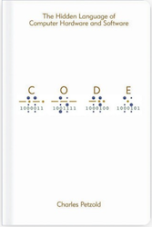](https://www.goodreads.com/book/show/44882.Code)
[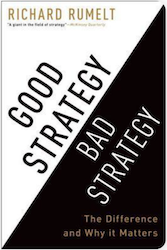](https://www.goodreads.com/book/show/11721966-good-strategy-bad-strategy)
[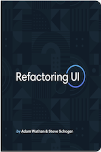](https://www.goodreads.com/book/show/43190966-refactoring-ui)
[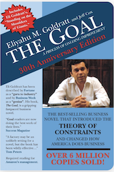](https://www.goodreads.com/book/show/113934.The_Goal)
[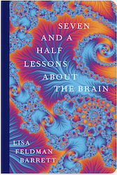](https://www.goodreads.com/book/show/56034793-seven-and-a-half-lessons-about-the-brain)
[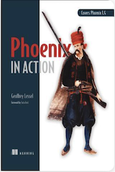](https://www.goodreads.com/book/show/42114632-phoenix-in-action)
[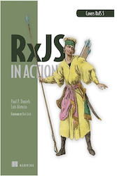](https://www.goodreads.com/book/show/30724353-rxjs-in-action)
[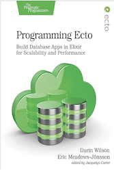](https://www.goodreads.com/book/show/40582814-programming-ecto)
[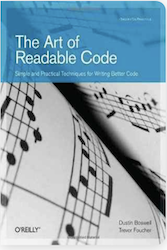](https://www.goodreads.com/book/show/8677004-the-art-of-readable-code)
[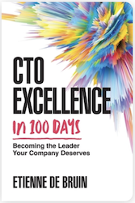](https://www.goodreads.com/book/show/113847910-cto-excellence-in-100-days)
[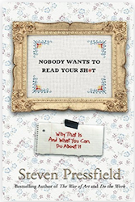](https://www.goodreads.com/book/show/30556551-nobody-wants-to-read-your-sh-t)
[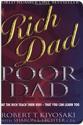](https://www.goodreads.com/book/show/69571.Rich_Dad_Poor_Dad)

<!--truncate-->

* **[5/5/] Code**: This book was in my bookshelf for some time now and I finally got around it. Although most of the concepts were known to me this is the first time that I felt everything coming together and got plenty of "Aha!" moments. I must admit, that a couple of chapters got too deep technically and I've only read them without trying to fully understand them, but they were definitely worth going through them. This book is a **MUST** for anyone into computer science
* **[4/5/] Good Strategy Bad Strategy**: I really enjoyed this book and how it defines strategy and makes a clear distinction between a good and a bad one. Lots of good real world examples and actionable ideas. I felt that a few sections could have been more compact but it definitely wasn't tiresome. I strongly recommend reading it
* **[4/5] Refactoring UI**: This book is not only for designers, but for developer as well. In fact, I would probably say that a developer needs to read this more than a designer. It definitely gives an interesting pespective on design and how to keep things clean and simple, to get things going instead of losing yourself into too much details. I strongly recommend reading it
* **[4/5] The Goal**: A very well written process improvement novel. The story was very realistic  with practical lessons that can be applied to the real world. For me, an important lesson here was that open-minded teams which want to solve problems and improve, will find the way by communicating well and by being willing to go through an iterative process. The story will probably be more interesting to people that are in the manufacturing industry but in general I find it useful for anyone that deals with process flows. It was a breez reading it and if you liked it and you are in IT, I also strongly recommend reading *The Phoenix Project* by Gene Kim
* **[4/5] Seven and a Half Lessons About the Brain**: A short and very interesting book on human brain, a subject that I find fascinating. Two things really hit me when I was reading this book. The first one is the way the book phrases the fact that our brain can create reality and that we live in a made up world. The second one, which it's the first time I read about it although it seems it is known in this circle for some time now, is that we do not have a triune brain in which we can blame our primitive behavior when e.g get angry, but we simple have a differently evolved brain from other species and our irational thoughts can simple be attributed to body budgeting reasons. A very interesting idea that if accepted world wide, it will affect society at it's core, especially in law cases. If you are interested about the human brain, then definitely read this
* **[4/5] Phoenix in Action**: A nice and easy read about the Phoenix framework which gives you a good overview with detailed examples of what is possible with it. I feel that the Elixir sections could have been more compact in order to make you read an Elixir-specific book that covers the subject better and maybe write more about of Phoenix, but I definitely didn't mind. This book is a good entry point for learning about the framework but things are moving within the Phoenix community and some code/techniques might not apply at the time you read it, so I strongly recommend that you also have a look at the very well written, [official Phoenix documentation](https://hexdocs.pm/phoenix/Phoenix.html)
* **[4/5] Programming Ecto**: A well written and helpful resource about Ecto. Altough *Phoenix in Action* had a lot of information about it, I felt that I had some gaps which this book definitely filled. Lot's of practical examples. What I also liked about the book is that it specifically covered real scenarios which in my opinion are pretty common. I strongly recommend reading it after *Phoenix in Action*
* **[4/5] RxJS in Action**: Reactive programming is a very interesting and powerful programming technique, especially in UI where a lot of things are happening asynchronously at the same time,  and this book will definitely help you get into it by using RxJS. Lot's of real world examples and practical ideas. Some sections were a little bit more dense and more tiring than others but definitely worth the trouble reading them. I feel that some examples which showed a bad way to achieve something were missing their counterpart, the good way to actually do it and not just explaining it in theory. I definitely feel though that I now know much more about RxJS than before reading it
* **[3/5] The Art of Readable Code**: I have mixed feelings about this book since I am not sure to whom is addressed. Lot's of legit advice and ideas, but an experienced developer should already know all of this. A junior developer however, will not, but some of the advice in here might not be understood until the developer actually experiences it in a real code base. I definitely recommend that any junior developer should read this, and perhaps a more senior should go through it and refresh what they already know. I mostly agree with everything described in here but I would really love to if the author showed some functional programming as well 
* **[3/5] CTO Excellence in 100 Days**: I am not even sure if the book is worth the 3/5 I gave it. It's probably somewhere between 2 and 3. It was very basic and it was mostly about people having lack of confidence into becoming CTOs than actually being CTOs. I believe there are better books out there that can enhance your understanding of a technical role better, especially the role of a CTO. For example, I found *The Startup CTO's handbook* by Zach Goldberg much much better. I wouldn't recommend this one
* **[2/5] Nobody Wants to Read Your Shit**: A very mediocre book with just a catchy title. I didn't even manage to finish it. Stopped at around 2/3 of the book. Even if there was some solid advice here and there, it was VERY basic and kinda boring. Don't waste your time
* **[1/5] Rich Dad, Poor Dad**: This book is just, sad. Among other things, the author basically says to pray on the weak in order to create wealth. Even if I completely put my feelings 
aside and judge the book more objectively, it only contains repetetive information without any actionable advice. Just a generic "learn what is an asset and what is a liability" mantra that is thrown around in most of the pages. I really do not understand why this book is a best seller. Definitely learn about investing and finance, just not from this. He did manage to do something right though; to properly market the book and take our money