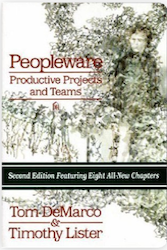
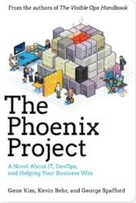
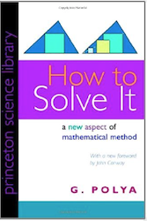
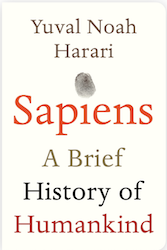
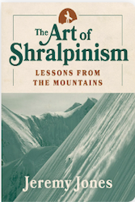
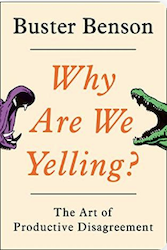

<!--truncate-->

* **[5/5/] Peopleware: Productive Projects and Teams**: If you are a manager in a software company then you need to read this NOW. The important lesson here is that people are the core of any development process, something that a lot of managers forget most of the time. The book was written in 1987 and still applies today.
* **[5/5/] The Phoenix Project**: Loved it. I started reading it a couple of years ago and left it in the middle so decided to start from the beginning again. I am glad I did that because it was definitely worth my full attention. I am pretty sure that anyone long enough in IT will appreciate it and resonate with Bill's (the hero of the book) daily "adventures" in the crazy world of technology mixed with business. I also recommend reading *The Goal, by Eliyahu M. Goldratt* which I believe it's what basically inspired the writing of this book as well.
* **[4/5] How to Solve It: A New Aspect of Mathematical Method**: A very insighful book which applies even today, even if it's written in 1945 and it's around mathematics and geometry. Although it gets a bit repetetive, it's definitely worth it since it's filled with examples in order to help the reader understand its underlying framework for problem solving. Polya manages to translate his approach from the mathematics field to other domains that apply to our daily lifes.
* **[4/5/] Sapiens: A Brief History of Humankind**: A VERY complex and extensive topic that I think the author manages to summarize it pretty well in 500 pages and keeps the reader engaged. Lot's of interesting information and ideas, and even though I am sceptical about some, the fact that it does give an interesting perspective to human history is definitely intriguing and worth the read. The central idea around the book is that the humans did a huge mistake by turning from from being hunter-gatherers to agriculture which made them settle down, lose important knowledge and skills that all anchestors posesed and made us more miserable and harsh. Really enjoyed it, definitely recommend.
* **[3/5] The Art of Shralpinism: Lessons from the Mountains**: When a master speaks, you listen. Jeremy Jones is definitely a master in snowboarding and mounteneering and I was anxious to read his book. I really, really wanted to love it but I am afraid, it failed short to my expectations. First of all, there are a lot of story sections which due to the chosen font and background, are either very hard to read or compltely unreadable. Secondly, I was expecting to gain some deep knowledge which someone can only gain by doing it, and even though Jeremy Jones has been out there for a long time and have gained years and years of experience, he has failed to transfer at least some of it. Although there are tips and technical notes in the book here and there, in general it felt a little bit vague. Sorry Jeremy, I still respect you deeply for doing what you are doing, but for the next book, get a writing consultant!
* **[1/5] Why Are We Yelling? The Art of Productive Disagreement**: A very interesting question which the author has failed to answer. At first, the book looks promising but as you keep going the author starts rambling about gun violence, politics and other completely unrelated things with the topic. Do not waste your time.