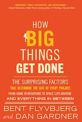
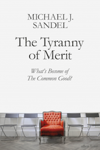
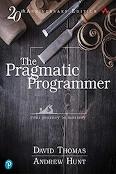
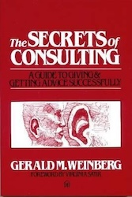
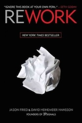

<!--truncate-->

* **[5/5/] How big things get done**: This was a very, VERY, good read. This is how a book, filled with real experience and backed by data looks like. One of the very few management books that I have read that it didn't feel like "vague stories" but as real, hard earned insights from actual projects. I strongly recommend reading it. If I had to keep one thing from the whole book is this: Think slow, act fast.
* **[5/5/] The Tyranny of Merit: What's Become of the Common Good?**: This book was a great eye-opener regarding the dangers of meritocracy. The core idea is that meritocracy breeds hubris among winners and humiliation among losers. I agree with the author’s argument that meritocracy ignores a crucial factor: luck. It convinces people that their success is entirely of their own making, while blinding them to the advantages that allowed them to succeed in the first place. The result is not just inequality, but a moral divide that erodes solidarity. A strong and unsettling read.
* **[5/5/] The Pragmatic Programmer: From Journeyman to Mastery, 20th Anniversary Edition**: It has been some time since I read the original version of the book and the anniversary edition was sitting there in my bookshelf so I felt like re-reading it. I am glad I did. This is a book that every software engineer should read. Years of distilled experience are written in these pages and the important part is not the code examples, it's the philosophy of the book with which I agree 100%. YOU are responsible for the quality of your work. Not your tools, not your manager, not the process. YOU. Be adaptable and never stop improving yourself by treating software development as a continuous learnign and decision-making discipline.
* **[4/5/] The Secrets of Consulting: A Guide to Giving and Getting Advice Successfully**: This is probably one of the few books I have read about consulting and genuinely liked. Its core idea is that consulting is fundamentally a human and political activity, not a technical one. Success depends less on having the "right" answers and more on managing expectations, relationships, and responsibility. I completely agree with this perspective. The book does a great job of describing common pitfalls consultants fall into and stays practical throughout. I highly recommend it, especially if you’re considering venturing into the consulting world.
* **[4/5/] Rework**: I really like the way these guys (Jason Fried and David Heinemeier Hansson) work. They get things done and consistently cut through the BS to focus on what really matters: delivering value. The book challenges many assumptions people take for granted about work and growth. Its core message is that simplicity, focus, and restraint often beat scale, speed, and ambition. Some ideas felt quite opinionated and context-dependent, but overall it offers a refreshing perspective on running a business without the hustle and overcomplication that most organizations fall into these days. Definitely an interesting read.